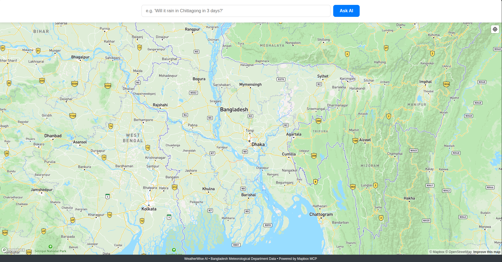

# Weather Forecast MCP System

A production-ready weather forecasting system for Bangladesh that leverages the **Model Context Protocol (MCP)** to integrate geospatial tools, real-time weather data, and AI reasoning.



## 🌟 Features

- **District-Based Weather Matching**: Directly matches user queries to Bangladesh district names in BMD WRF tables
- **Context-Aware Responses**: Differentiates between farmer and citizen contexts with tailored advice
- **Real BMD Data Integration**: Scrapes live weather forecasts from Bangladesh Meteorological Department
- **MCP Architecture**: Implements custom MCP servers for weather operations
- **Gemini AI Integration**: Uses Google's Gemini 1.5 Flash for natural language explanations
- **Bangla/English Support**: Handles both Bengali and English district names seamlessly

## 🏗️ System Architecture

```
User Query → LLM Agent → District Extraction → Weather MCP → BMD Scraping → Response
     ↑          ↓             ↑                   ↑              ↓
   Frontend ← Mapbox       Custom MCP        BAMIS.gov.bd    Explanation
```

### Core Components

1. **LLM Agent** (`services/agent/`)
   - Processes user queries using Google Gemini
   - Detects context (farmer vs citizen)
   - Extracts district names and forecast days
   - Generates natural language explanations

2. **Custom MCP Server** (`services/agent/mcp_weather/`)
   - `retrieve_weather_forecast_by_district`: Scrapes BMD WRF tables by district name
   - Handles both Bengali and English district names
   - Returns structured weather data with 3+ parameters

3. **Frontend** (`frontend/`)
   - React + Mapbox GL JS interface
   - Natural language query input
   - Visual forecast display

## 🚀 Quick Start

### Prerequisites

- Docker & Docker Compose
- Google AI API Key ([Get from AI Studio](https://aistudio.google.com/app/apikey))
- Mapbox Access Token ([Get from Mapbox](https://account.mapbox.com/access-tokens))

### Setup

1. **Clone the repository**
   ```bash
   git clone https://github.com/Sgt-Hashtag/weather-forecast-mcp.git
   cd weather-forecast-mcp
   ```

2. **Configure environment variables**
   ```bash
   cp .env.example .env
   # Edit .env with your API keys
   nano .env
   ```

3. **Build and start services**
   ```bash
   docker compose up --build -d
   ```

4. **Access the application**
   Open [http://localhost:3000](http://localhost:3000) in your browser

## 🧪 Example Queries

| Query | Context | Days | District |
|-------|---------|------|----------|
| "Will it rain in Dhaka in 3 days?" | Citizen | 3 | Dhaka |
| "I'm a farmer near Chittagong. Enough rain in 5 days?" | Farmer | 5 | Chittagong |
| "Weather forecast for Pabna tomorrow" | Unknown | 1 | Pabna |
| "7-day forecast for Cox's Bazar" | Unknown | 7 | Cox's Bazar |

## 🔧 Technical Details

### Data Sources

- **Weather Data**: [BMD WRF Tables](https://www.bamis.gov.bd/en/bmd/wrf/table/all/)
- **Geocoding**: District name extraction from query text (no external API required)
- **AI Model**: Google Gemini 2.5 Flash

### MCP Tools Implemented

| Tool | Parameters | Description |
|------|------------|-------------|
| `retrieve_weather_forecast_by_district` | `district_name`, `forecast_days`, `parameters` | Scrapes BMD WRF table for specific district |

### District Name Handling

The system supports both **Bengali** and **English** district names:

| Bengali | English |
|---------|---------|
| পাবনা | Pabna |
| ঢাকা | Dhaka |
| চট্টগ্রাম | Chattogram |
| কক্সবাজার | Cox's Bazar |

### BMD Table Structure

The BMD WRF tables provide comprehensive weather data with the following columns:
- **Temperature**: MIN, AVG, MAX (°C)
- **Humidity**: MIN, AVG, MAX (%)
- **Soil Moisture**: MIN, AVG, MAX (%)
- **Rainfall**: Total (mm) - appears twice in the table
- **Wind**: Speed MIN, AVG, MAX (km/h) and Direction MIN, AVG, MAX (°)
- **Clouds**: Fraction High, Low, Medium (Octa)

## 📊 Weather Parameters

Each forecast includes **3+ required parameters**:

1. **Temperature**: Min/max in Celsius
2. **Precipitation**: Rainfall in mm with probability
3. **Humidity**: Percentage value

## 🧪 Testing

Run end-to-end tests:
```bash
python scripts/test_e2e.py
```

Manual API testing:
```bash
curl -X POST http://localhost:8000/query \
  -H "Content-Type: application/json" \
  -d '{"query": "Will it rain in Pabna in 3 days?"}'
```

## 📈 Context-Aware Explanations

### Farmer Context
> "For farmers near Pabna, the forecast shows 8mm rainfall (40% chance) with temperatures 24-32°C. Good rainfall for crop growth – no additional irrigation needed at this time. Humidity levels at 75% may impact crop health – consider fungal disease prevention measures if above 70%."

### Citizen Context  
> "Weather forecast for Pabna: 8mm rain expected (40% chance) with temperatures 24-32°C. Carry an umbrella for your commute and outdoor activities. Humidity at 75% – comfortable conditions for daily activities."

## 🛠️ Troubleshooting

### Common Issues

1. **"NoneType object is not subscriptable"**
   - Cause: Mapbox MCP tool name mismatch
   - Solution: System now uses direct district extraction (no Mapbox dependency)

2. **BMD scraping fails**
   - Cause: SSL certificate issues or URL formatting
   - Solution: Uses `verify=False` and proper URL formatting

3. **District not found**
   - Cause: Spelling variations (Chittagong vs Chattogram)
   - Solution: Comprehensive Bengali/English mapping

### Debugging Commands

```bash
# Check agent logs
docker compose logs agent

# Test BMD scraping directly
python services/agent/scripts/test_bmd_scraping.py

# Verify district extraction
python -c "from mcp_client import MCPClientManager; print(MCPClientManager()._extract_district_from_query('I am in pabna'))"
```

## 🙏 Acknowledgments

- **Bangladesh Meteorological Department** for providing open weather data
- **Google AI** for the Gemini API
- **Mapbox** for mapping infrastructure
- **Model Context Protocol** specification enabling tool interoperability

---

*Built with ❤️ for Bangladesh's farming and urban communities* 🌾🏙️