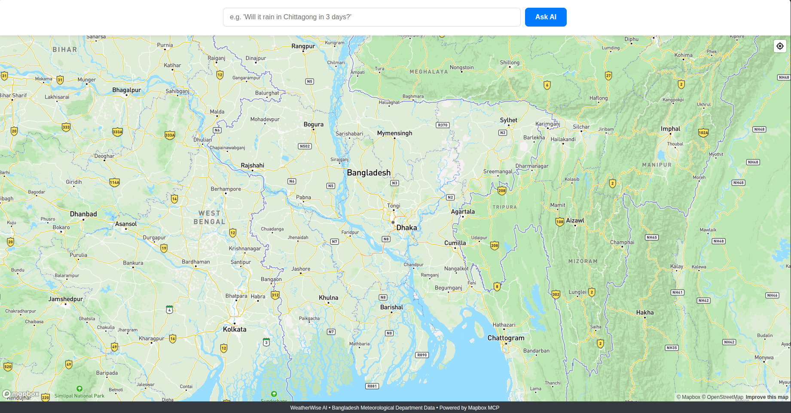

# Weather Forecast MCP System

A production-ready weather forecasting system for Bangladesh that leverages the **Model Context Protocol (MCP)** to integrate geospatial tools, real-time weather data, and AI reasoning.



## 🌟 Features

- **District-Based Weather Matching**: Directly matches user queries to Bangladesh district names in BMD WRF tables
- **Context-Aware Responses**: Differentiates between farmer and citizen contexts with tailored advice
- **Real BMD Data Integration**: Scrapes live weather forecasts from Bangladesh Meteorological Department
- **MCP Architecture**: Implements custom MCP servers for weather operations
- **Gemini AI Integration**: Uses Google's Gemini 1.5 Flash for natural language explanations
- **Bangla/English Support**: Handles both Bengali and English district names seamlessly

## 🏗️ System Architecture

```
User Query → LLM Agent → District Extraction → Weather MCP → BMD Scraping → Response
     ↑          ↓             ↑                   ↑              ↓
   Frontend ← Mapbox       Custom MCP        BAMIS.gov.bd    Explanation
```

### Core Components

1. **LLM Agent** (`services/agent/`)
   - Processes user queries using Google Gemini
   - Detects context (farmer vs citizen)
   - Extracts district names and forecast days
   - Generates natural language explanations

2. **Custom MCP Server** (`services/agent/mcp_weather/`)
   - `retrieve_weather_forecast_by_district`: Scrapes BMD WRF tables by district name
   - Handles both Bengali and English district names
   - Returns structured weather data with 3+ parameters

3. **Frontend** (`frontend/`)
   - React + Mapbox GL JS interface
   - Natural language query input
   - Visual forecast display

## 🚀 Quick Start

### Prerequisites

- Docker & Docker Compose
- Google AI API Key ([Get from AI Studio](https://aistudio.google.com/app/apikey))
- Mapbox Access Token ([Get from Mapbox](https://account.mapbox.com/access-tokens))

### Setup

1. **Clone the repository**
   ```bash
   git clone https://github.com/Sgt-Hashtag/weather-forecast-mcp.git
   cd weather-forecast-mcp
   ```

2. **Configure environment variables**
   ```bash
   cp .env.example .env
   # Edit .env with your API keys
   nano .env
   ```

3. **Build and start services**
   ```bash
   docker compose up --build -d
   ```

4. **Access the application**
   Open [http://localhost:3000](http://localhost:3000) in your browser

## 🧪 Example Queries

| Query | Context | Days | District |
|-------|---------|------|----------|
| "Will it rain in Dhaka in 3 days?" | Citizen | 3 | Dhaka |
| "I'm a farmer near Chittagong. Enough rain in 5 days?" | Farmer | 5 | Chittagong |
| "Weather forecast for Pabna tomorrow" | Unknown | 1 | Pabna |
| "7-day forecast for Cox's Bazar" | Unknown | 7 | Cox's Bazar |

## 🔧 Technical Details

### Data Sources

- **Weather Data**: [BMD WRF Tables](https://www.bamis.gov.bd/en/bmd/wrf/table/all/)
- **Geocoding**: District name extraction from query text (no external API required)
- **AI Model**: Google Gemini 2.5 Flash

### MCP Tools Implemented

| Tool | Parameters | Description |
|------|------------|-------------|
| `retrieve_weather_forecast_by_district` | `district_name`, `forecast_days`, `parameters` | Scrapes BMD WRF table for specific district |

### District Name Handling

The system supports both **Bengali** and **English** district names:

| Bengali | English |
|---------|---------|
| পাবনা | Pabna |
| ঢাকা | Dhaka |
| চট্টগ্রাম | Chattogram |
| কক্সবাজার | Cox's Bazar |

### BMD Table Structure

The BMD WRF tables provide comprehensive weather data with the following columns:
- **Temperature**: MIN, AVG, MAX (°C)
- **Humidity**: MIN, AVG, MAX (%)
- **Soil Moisture**: MIN, AVG, MAX (%)
- **Rainfall**: Total (mm) - appears twice in the table
- **Wind**: Speed MIN, AVG, MAX (km/h) and Direction MIN, AVG, MAX (°)
- **Clouds**: Fraction High, Low, Medium (Octa)

## 📊 Weather Parameters

Each forecast includes **3+ required parameters**:

1. **Temperature**: Min/max in Celsius
2. **Precipitation**: Rainfall in mm with probability
3. **Humidity**: Percentage value

## 🧪 Testing

Run end-to-end tests:
```bash
python scripts/test_e2e.py
```

Manual API testing:
```bash
curl -X POST http://localhost:8000/query \
  -H "Content-Type: application/json" \
  -d '{"query": "Will it rain in Pabna in 3 days?"}'
```

## 📈 Context-Aware Explanations

### Farmer Context
> "For farmers near Pabna, the forecast shows 8mm rainfall (40% chance) with temperatures 24-32°C. Good rainfall for crop growth – no additional irrigation needed at this time. Humidity levels at 75% may impact crop health – consider fungal disease prevention measures if above 70%."

### Citizen Context  
> "Weather forecast for Pabna: 8mm rain expected (40% chance) with temperatures 24-32°C. Carry an umbrella for your commute and outdoor activities. Humidity at 75% – comfortable conditions for daily activities."

## 🛠️ Troubleshooting

### Common Issues

1. **"NoneType object is not subscriptable"**
   - Cause: Mapbox MCP tool name mismatch
   - Solution: System now uses direct district extraction (no Mapbox dependency)

2. **BMD scraping fails**
   - Cause: SSL certificate issues or URL formatting
   - Solution: Uses `verify=False` and proper URL formatting

3. **District not found**
   - Cause: Spelling variations (Chittagong vs Chattogram)
   - Solution: Comprehensive Bengali/English mapping

### Debugging Commands

```bash
# Check agent logs
docker compose logs agent

# Test BMD scraping directly
python services/agent/scripts/test_bmd_scraping.py

# Verify district extraction
python -c "from mcp_client import MCPClientManager; print(MCPClientManager()._extract_district_from_query('I am in pabna'))"
```

## 🙏 Acknowledgments

- **Bangladesh Meteorological Department** for providing open weather data
- **Google AI** for the Gemini API
- **Mapbox** for mapping infrastructure
- **Model Context Protocol** specification enabling tool interoperability

---

*Built with ❤️ for Bangladesh's farming and urban communities* 🌾🏙️


---

## Field Boundary Delineation (agribound)

Agricultural field boundary delineation is implemented as an optional pipeline step powered by [agribound](https://github.com/montimaj/agribound) and Google Earth Engine.

### How it works

```
User query with coordinates
        ↓
GEE downloads Sentinel-2 composite (full-year median, 10m, cloud-masked)
        ↓
Step 1 — DelineateAnything (YOLO instance segmentation) → field polygons GeoJSON
        ↓
Step 2 — FTW / Fields of the World (semantic segmentation) → refines boundaries
        ↓
LULC filter — Google Dynamic World crop probability > 0.3 (removes non-agricultural detections)
        ↓
GeoJSON output + map overlay
```

**Important:** Both Step 1 and Step 2 are field *boundary* detection only — no crop type classification is performed. The `crop_type` field in output will always be `"Unknown"`.

### Additional Prerequisites

- **GEE Project ID**: A registered Google Earth Engine project
- **Service account credentials**: JSON key file with GEE access
- **NVIDIA GPU** (recommended): RTX-class GPU with CUDA 12.x drivers. CPU fallback works but is slow.

### Credentials Setup

Place your GEE service account JSON at either:
```
secrets/credentials.json
secrets/service-account.json
```

The `secrets/` directory is mounted read-only into the container at `/app/secrets/`.

### Environment Variables

Add to your `.env`:
```
GEE_PROJECT_ID=your-gee-project-id
```

### Triggering Field Delineation

The agent detects delineation intent from natural language. Always include explicit coordinates:

```
"Delineate field boundaries at latitude 30.9 longitude 75.5"
"Show me farm boundaries at lat 23.5 lon 90.3"
"My land at latitude 28.6 longitude 77.2"
```

Using the provided script:
```bash
# Edit the coordinates inside the script, then run:
bash scripts/query_field_boundaries.sh
# Output saved to results/result.json
```

Or directly with curl:
```bash
curl -X POST http://localhost:8000/query \
  -H "Content-Type: application/json" \
  -d '{"query": "Delineate field boundaries at latitude 30.9 longitude 75.5"}'
```

**Always provide explicit coordinates.** Without them, the agent geocodes the location name and may return 0 results if the area has low crop probability in Google Dynamic World (threshold: 0.3).

### GPU vs CPU Mode

GPU inference is opt-in. The base `docker-compose.yml` runs entirely on CPU and works on any machine. A separate `docker-compose.gpu.yml` override activates GPU mode.

> **Why two files?** Docker Compose does not support conditional YAML blocks. The `deploy.resources.reservations.devices` section that reserves a GPU device hard-fails on machines without the NVIDIA Container Toolkit — regardless of any env var. The override file pattern is the standard Docker solution for this.

#### CPU mode (default, no GPU required)

```bash
docker compose up --build -d
```

PyTorch CPU wheels are installed by default (~500 MB). Inference runs on CPU — slower but works everywhere.

#### GPU mode

**Requirements:**
- NVIDIA GPU with CUDA 12.x drivers
- [NVIDIA Container Toolkit](https://docs.nvidia.com/datacenter/cloud-native/container-toolkit/install-guide.html) installed on the host

**Step 1 — Build with CUDA PyTorch wheels:**
```bash
docker compose -f docker-compose.yml -f docker-compose.gpu.yml \
  build --build-arg TORCH_INDEX_URL=https://download.pytorch.org/whl/cu128
```

`cu128` targets CUDA 12.8. For older drivers use `cu121` or `cu118`. CPU wheels are ~500 MB; CUDA wheels are ~2.5 GB.

**Step 2 — Start with GPU override:**
```bash
docker compose -f docker-compose.yml -f docker-compose.gpu.yml up -d
```

This merges `docker-compose.gpu.yml` on top of the base file, which:
- Sets `GPU_INFERENCE=true` → agribound uses `device="auto"` (resolves to CUDA)
- Reserves one NVIDIA GPU for the container

**Verify GPU is active:**
```bash
docker exec weather-forecast-mcp-agent-1 python -c "import torch; print(torch.cuda.is_available())"
# Expected: True
```

Check agent logs to confirm the device at startup:
```bash
docker compose logs agent | grep "Inference device"
# Expected: Inference device: auto (GPU_INFERENCE=true)
```

### Known Constraints

| Constraint | Detail |
|---|---|
| AOI size | 0.02° buffer (~2.2 km) around the point — minimum for FTW's 256px patch requirement |
| LULC filter | Polygons are dropped if Google Dynamic World crop probability < 0.3 — urban and forest areas will return 0 fields |
| Cache | Sentinel-2 composite is cached at `/tmp/.agribound_cache/`; cleared before each run to avoid stale results |
| Workers | `n_workers=0` is required — CUDA context cannot be inherited by forked DataLoader processes in Docker |
| Crop classification | Not implemented — output `crop_type` is always `"Unknown"` |

### Extracting Raw Satellite Composites

After a successful delineation, the Sentinel-2 composite is saved inside the container at:
```
/tmp/patches/{lat}_{lon}/sentinel2_composite.tif   ← GeoTIFF with CRS + transform
/tmp/patches/{lat}_{lon}/sentinel2_composite.npy   ← numpy array, shape (12, H, W), float32
```

Copy to host:
```bash
./get_patches.sh              # copies to ./patches/
./get_patches.sh ~/my_patches # custom output dir
```

Load in Python:
```python
import rasterio, numpy as np

# With spatial metadata (CRS, pixel size, bounding box)
with rasterio.open("patches/30.900000_75.500000/sentinel2_composite.tif") as src:
    arr = src.read()        # shape: (12, H, W) — S2 bands B1..B12
    transform = src.transform

# Plain numpy
arr = np.load("patches/30.900000_75.500000/sentinel2_composite.npy")
```

Sentinel-2 bands (in order): B1, B2, B3, B4, B5, B6, B7, B8, B8A, B9, B11, B12
